# Arsenal – Modern Military Weapons for Fabric

A Fabric mod for **Minecraft 26.3**: modern small arms, rocket launchers, hand grenades, mines and body armour.

- **Eleven weapons**: two pistols, a submachine gun, two assault rifles, two shotguns, two sniper rifles, the RPG-7 and the FGM-148 Javelin
- **Real ballistics**: bullets fly with their real muzzle velocity, drop under gravity, lose speed to drag, go through glass and planks but not stone, and hurt more in the head than in the legs
- **Body armour that works the way it does in reality**: a Kevlar vest stops pistol rounds but hardly slows a rifle bullet; ceramic plates stop rifles, not a .50 BMG; and neither protects your legs
- **Grenades**: fragmentation, flashbang and smoke
- **Mines and charges**: the M18A1 claymore with tripwire sensor or firing device, anti-personnel and anti-tank mines, C4
- A combat knife, a mine detector, weapon racks and an ammunition crate

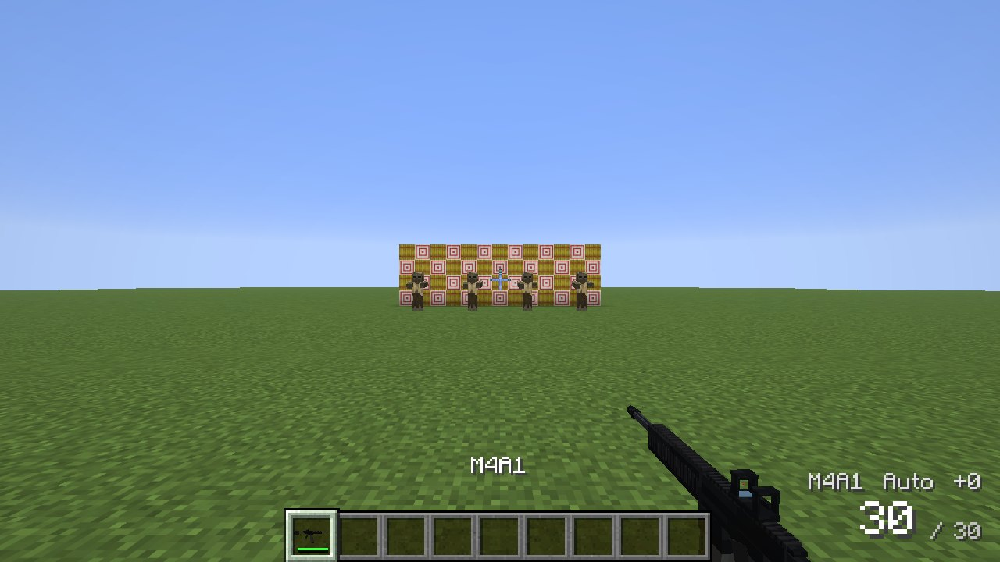

## Installing with Prism Launcher

1. Create an instance with Minecraft **26.3** and the **Fabric** loader (0.19.5 or newer).
2. Add **Fabric API** (Edit → Mods → Download mods).
3. Add `arsenal-1.1.0.jar` (Edit → Mods → Add file).
4. On a server, put the jar and Fabric API into `mods/`. Every player needs the mod too.

The download site also offers an auto-updating Prism instance that brings all our mods, including this one.

## Controls

| Key | |
|---|---|
| **Left click** | Fire. Hold for automatic fire. |
| **Right click** (hold) | Aim down the sights: zoom, much better accuracy, slower walking. Through a scope or launcher optic the view becomes the sight picture. |
| **R** | Reload |
| **B** | Switch fire mode (semi / burst / auto). On a shotgun: choose the shell to load next (buckshot or slug). |

Both keys can be changed under Options → Controls → Arsenal. With a gun in your hand, left click never breaks blocks or punches.

The **HUD** shows the rounds in the magazine (red when empty), the gun, the fire mode and how much ammunition you carry. A hit marker flashes at the crosshair when you hit someone: grey if body armour stopped the round, red for a headshot, bigger for a kill.

| Aiming the M4A1 through its holographic sight | Iron sights of the AK-47 |
|---|---|
| 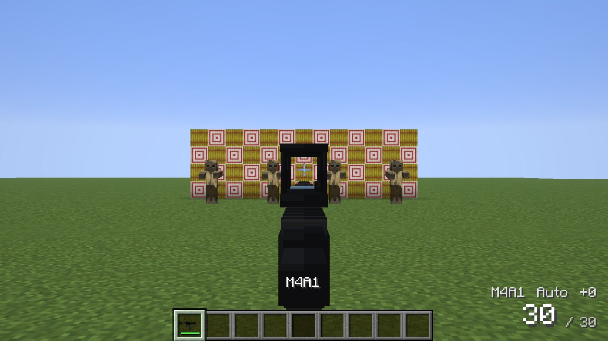 | 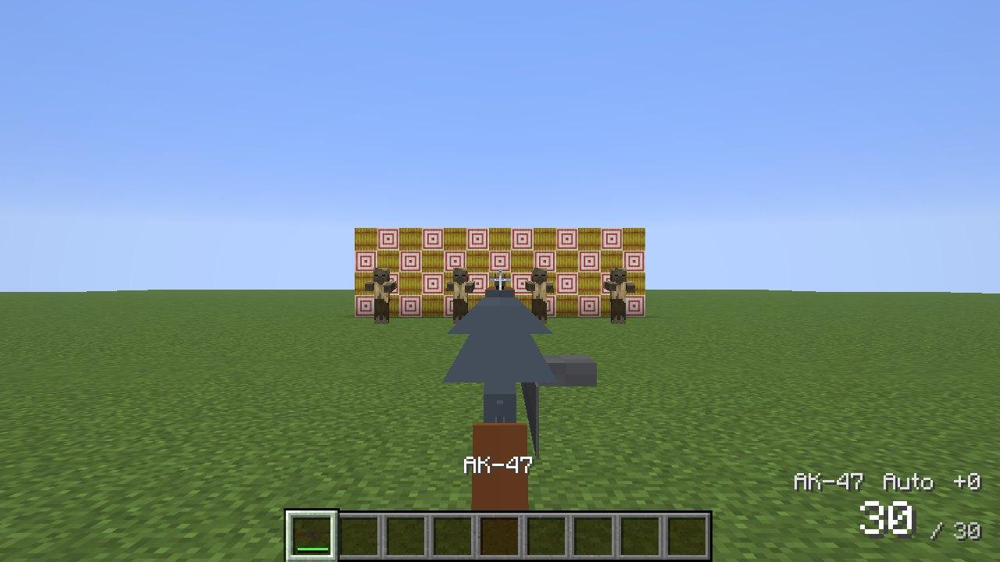 |

## The weapons

| Weapon | Type | Cartridge | Magazine | Rate of fire | Modes | Sight |
|---|---|---|---|---|---|---|
| **Glock 17** | Pistol | 9×19 mm | 17 | semi | semi | iron sights |
| **Desert Eagle** | Pistol | .50 AE | 7 | semi | semi | iron sights |
| **MP5A3** | Submachine gun | 9×19 mm | 30 | 800/min | semi, burst, auto | drum diopter |
| **M4A1** | Assault rifle | 5.56×45 mm NATO | 30 | 800/min | semi, auto | holographic sight |
| **AK-47** | Assault rifle | 7.62×39 mm | 30 | 600/min | auto, semi | iron sights |
| **Remington 870** | Pump shotgun | 12 gauge | 6 | pump | semi | bead |
| **Benelli M4** | Semi-auto shotgun | 12 gauge | 7 | semi | semi | ghost ring |
| **AWM** | Bolt-action sniper rifle | .338 Lapua Magnum | 5 | bolt | semi | 10× scope |
| **Barrett M82A1** | Anti-materiel rifle | .50 BMG | 10 | semi | semi | 10× scope |
| **RPG-7** | Rocket launcher | PG-7V rocket | 1 | – | – | PGO-7 optic |
| **FGM-148 Javelin** | Guided missile | Javelin missile | 1 | – | – | CLU, 4× |

The models are built to their real dimensions: on a weapon rack or in an item frame they are shown at true size.

- **Recoil** kicks the muzzle up and sideways with every shot. It is gentler when you aim and when you crouch.
- **Accuracy** suffers from the hip, when running and most of all when jumping; aimed and standing still, the rifles are precise.
- **Reloading** takes as long as it does in reality. An empty magazine takes longer: the bolt has to be released. Shotguns are loaded shell by shell, and you can fire between two shells.
- The pump and the bolt are worked after every shot (you hear it); a pistol's slide locks back on the last round.
- **Bullet holes** stay on what you hit for a minute. Glass, panes and ice shatter.
- **Heavier weapons slow you down**: sniper rifles and launchers by 10 to 18 %.

| Scope of the AWM: the bullet hole where the round struck | Weapons on mannequins |
|---|---|
| 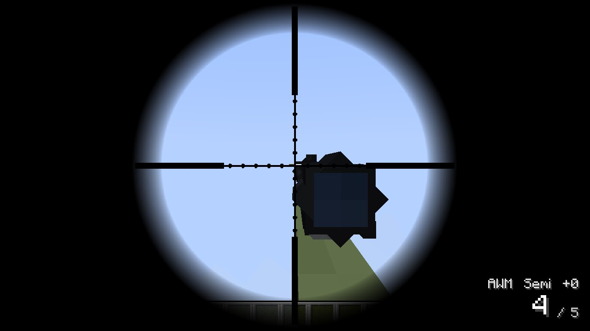 | 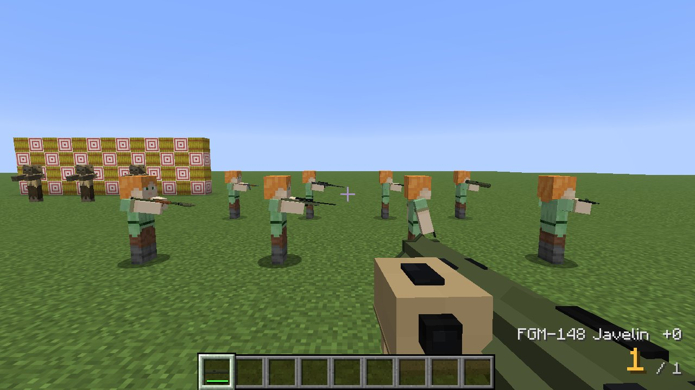 |

## Ammunition and ballistics

One block is one metre, so every round flies at its real speed and drops 9.81 m/s² under gravity. A sniper has to aim over a target 800 m away. Damage falls with the bullet's energy as drag slows it down.

| Cartridge | Muzzle velocity | Damage (hearts) | Goes through |
|---|---|---|---|
| 9×19 mm | 375 m/s | 3 | glass, a plank |
| .50 AE | 470 m/s | 5.5 | glass, a plank |
| 5.56×45 mm | 910 m/s | 4 | two planks |
| 7.62×39 mm | 715 m/s | 4.75 | two planks, one of soil |
| 12 ga buckshot | 400 m/s | 9 pellets × 1.3 | glass |
| 12 ga slug | 470 m/s | 7 | a plank |
| .338 Lapua Magnum | 915 m/s | 12 | logs, soil, a body |
| .50 BMG | 853 m/s | 17 | a stone block, bodies |

**Where a bullet hits counts**:

| Hit zone | Damage |
|---|---|
| Head | × 2 |
| Torso | × 1 |
| Legs | × 0.75 |

**What a bullet goes through** depends on the material and the cartridge: leaves, glass and wool hardly slow it down, wood a little, soil more. Stone and metal stop all but the heaviest rounds, and obsidian stops everything. Water stops a bullet within a metre or two. Only .338 and .50 BMG rounds go through a body and on to whoever stands behind.

Bullets that pass close to your head crack (supersonic) or whizz (subsonic) by.

| Cartridge | Recipe (shapeless) | Yield |
|---|---|---|
| 9×19 mm | brass casing, gunpowder, iron nugget | 16 |
| .50 AE | 2 brass casings, 2 gunpowder, 2 iron nuggets | 8 |
| 5.56×45 mm | brass casing, 2 gunpowder, iron nugget, copper ingot | 24 |
| 7.62×39 mm | brass casing, 2 gunpowder, 2 iron nuggets, iron ingot | 24 |
| 12 ga buckshot | paper, gunpowder, 3 iron nuggets, brass casing | 8 |
| 12 ga slug | paper, gunpowder, iron ingot, brass casing | 6 |
| .338 Lapua Magnum | 2 brass casings, 3 gunpowder, copper ingot | 10 |
| .50 BMG | 3 brass casings, 4 gunpowder, iron ingot | 8 |
| PG-7V rocket | 2 explosive charges, 2 gunpowder, 2 iron ingots | 1 |
| Javelin missile | 3 explosive charges, 2 redstone, gold ingot, 2 iron ingots, copper ingot | 1 |

Brass casings come from a copper ingot and an iron nugget (8 at a time). In creative mode, reloading needs no ammunition.

## Body armour

| Armour | Covers | Pistols, buckshot | Rifles | .338 | .50 BMG | Fragments | Blast |
|---|---|---|---|---|---|---|---|
| **Kevlar vest** (NIJ IIIA) | torso | 85 % | 15 % | 5 % | – | 65 % | 15 % |
| **Plate carrier** (NIJ IV, ceramic plates) | torso | 95 % | 80 % | 50 % | 15 % | 80 % | 25 % |
| **Combat helmet** (NIJ IIIA) | head | 80 % | 15 % | 5 % | – | 65 % | 10 % |

The figures are the share of a hit the armour stops. Even a stopped round still hurts a little (blunt trauma).

- **Armour only protects what it covers.** A vest does nothing for a shot in the legs, and only the helmet protects the head.
- **Every hit wears the armour down.** Rifle rounds wear it more than pistol rounds, and a .50 BMG most of all. Worn plates protect less: at the end of their life they stop only half of what new ones do. Repair them with ceramic plates (plate carrier) or Kevlar fabric (vest, helmet) on an anvil.
- All three also count as ordinary armour (5, 7 and 3 points) against swords, arrows and claws. The plate carrier is heavy: it slows you down by 6 %.
- **Vest and helmet also take some of the blast** of any explosion, TNT and creepers included (up to 50 % together).

A test on the range (5.56 mm from 15 m into a zombie): bare 8 damage, Kevlar vest 6.8, plate carrier 1.6, into the legs with a plate carrier 6. A 9 mm: bare 6, Kevlar 0.9. In the head: 12 bare, 2.4 with a helmet.

| Plate carrier and helmet | Kevlar vest |
|---|---|
| 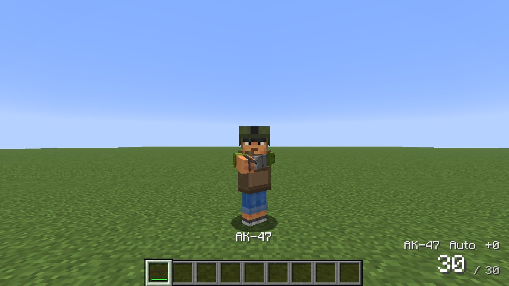 | 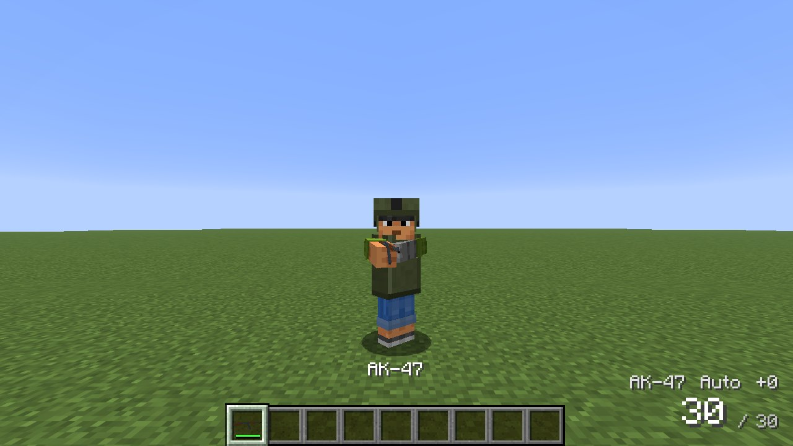 |

## Hand grenades

Hold right click to pull the pin; **the fuse is burning from then on**. Let go to throw; sneak for a short underhand lob. Hold on too long and it goes off in your hand. A bar under the crosshair shows the fuse. Grenades bounce off walls and roll.

| Grenade | Fuse | Effect |
|---|---|---|
| **M67** fragmentation | 4.5 s | blast deadly within about 4 m, 180 steel fragments out to 15 m (armour helps a lot against them) |
| **M84** stun grenade | 1.5 s | blinds whoever looks at it, for up to 6 s; deafens everyone near for up to 8 s (the world goes quiet and your ears ring); mobs nearby are blinded, slowed and lose their target |
| **M18** smoke | 1.5 s | a minute of thick white smoke |

Turning away from a flashbang or having a wall in between helps against the flash, but not against the bang.

| Frag grenade among the dummies | Flashbang | Smoke |
|---|---|---|
| 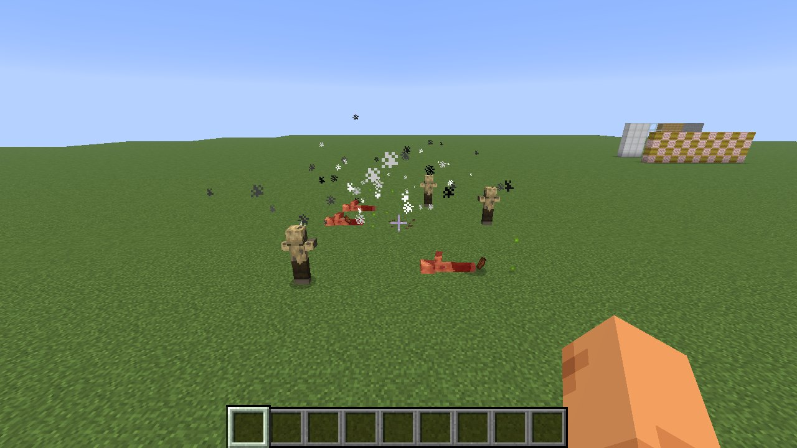 |  | 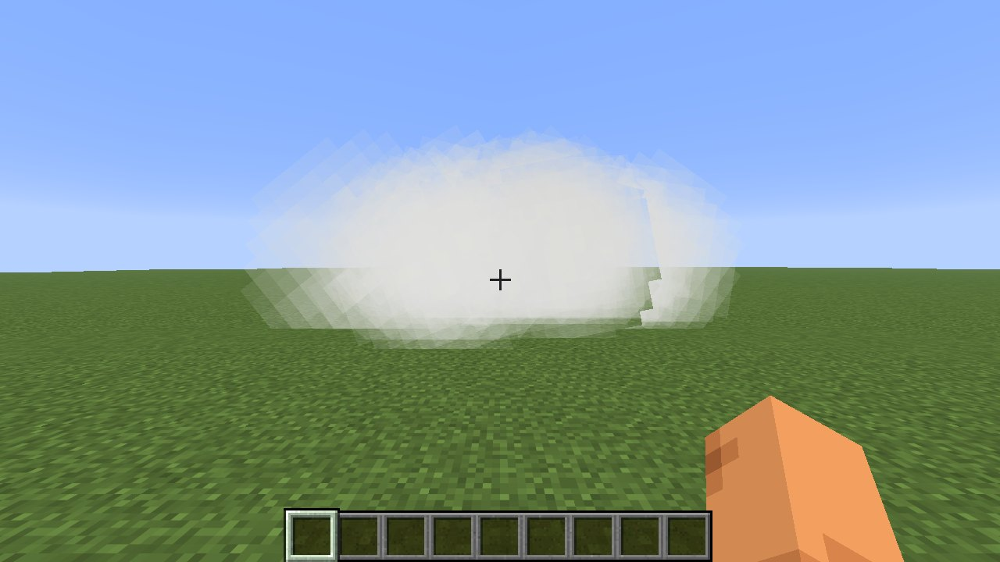 |

## Mines and charges

- **M18A1 claymore**: place it facing the enemy ("FRONT TOWARD ENEMY"). After 5 seconds its **sensor** is live: anyone who walks into the 70° fan in front of it, up to 6.5 m, sets it off. It fires 260 steel balls into a 60° fan, deadly to 45 m. The player who placed it is spared (configurable). Sneak + right click toggles the sensor.
- **M57 firing device** (the "clacker"): right click a claymore or C4 to wire it up (again to unwire). A wired claymore waits for command detonation. Right click into the air fires everything wired to the device, within 256 blocks.
- **Anti-personnel mine**: a small pressure mine. It arms 3 seconds after it is laid; whoever steps on it loses a leg (16 damage, armour does not help).
- **TM-62 anti-tank mine**: too much for a person's weight. Horses with a rider, carts, boats, iron golems and other big creatures set it off, with a blast that tears up the ground.
- **C4**: stick it to any surface. It goes off by firing device, by redstone signal, or when another explosion reaches it. Powerful enough to breach walls.

Charges caught in an explosion go off a moment later: chain reactions work. **A bullet that hits a mine, a claymore or C4 sets it off**, so you can clear a minefield from a distance.

**Disarming**: sneak and right click a mine or claymore with the **combat knife**. Digging up an armed mine any other way sets it off. The **AN/PSS-14 mine detector** beeps faster the closer you get to a mine, claymore or C4 within 6 m, and shows the distance.

| Claymore fired by the clacker | C4 through a stone brick wall | Mine detector |
|---|---|---|
| 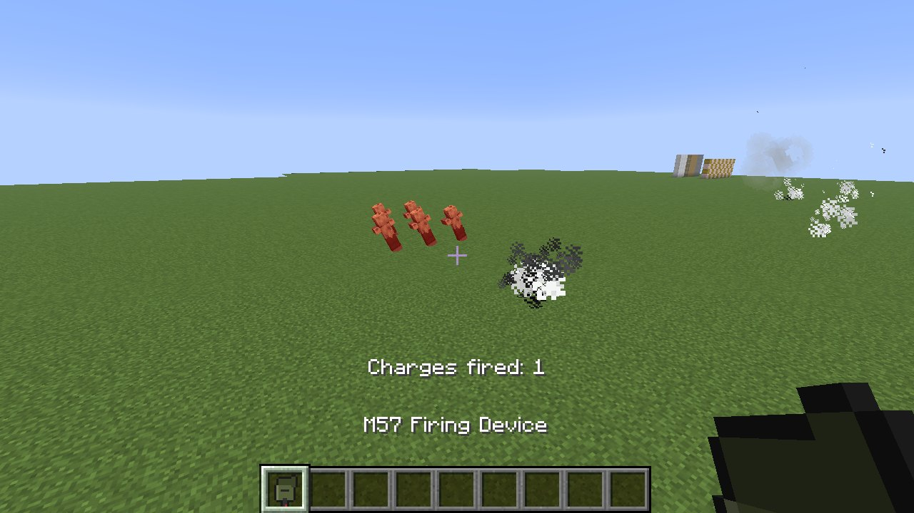 | 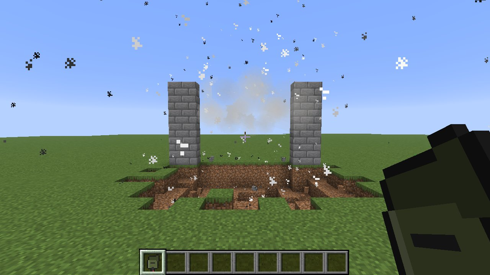 | 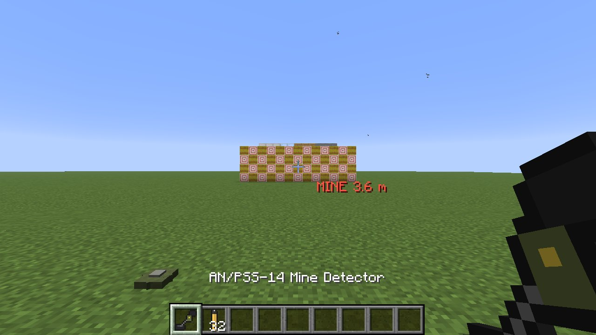 |

## Rocket launchers

**RPG-7**: a booster charge throws the rocket out at 115 m/s, and after about 11 m the sustainer pushes it to 295 m/s. It destroys itself after 920 m. The 85 mm HEAT warhead does 15 hearts to what it hits directly, and the blast breaks blocks (configurable). Through the PGO-7 optic you see its rangefinder chevrons. **Mind the backblast**: anyone up to 5 m behind you is burnt, and with a wall right behind you, it comes back at you. The launcher shows its rocket only while loaded.

**FGM-148 Javelin**: fire and forget. Aim through the command launch unit and hold the crosshair on a target (a creature, a vehicle or a spot on the ground) for **two seconds** until the seeker growl turns into the lock tone and the brackets turn red. Then fire. The missile is ejected softly, lights its motor clear of you, climbs high and **dives onto the target from above**, following it if it moves. Targets closer than 25 m are attacked directly.

| RPG-7 through the PGO-7 | The RPG's hole in a wall |
|---|---|
| 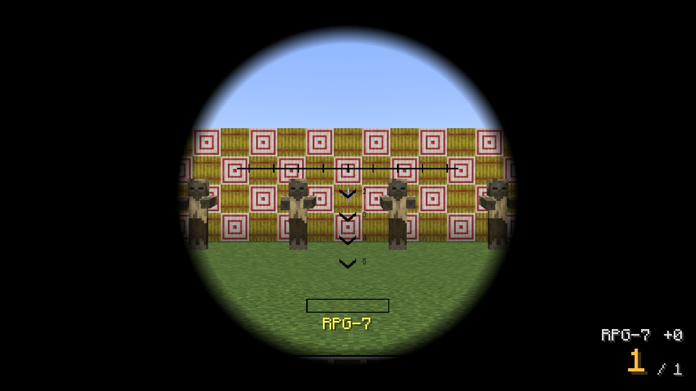 | 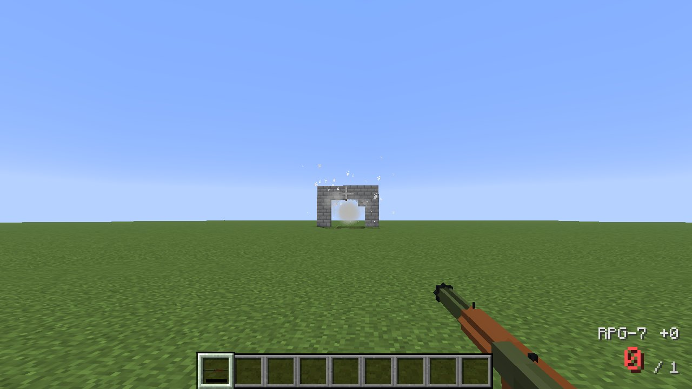 |

| Javelin locked on | Javelin climbing for its top attack |
|---|---|
| 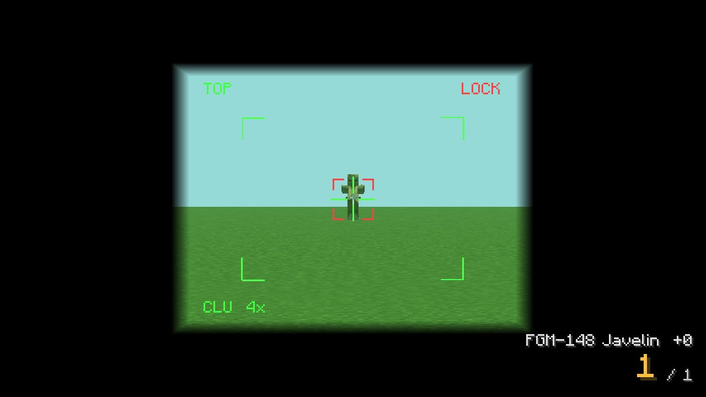 | 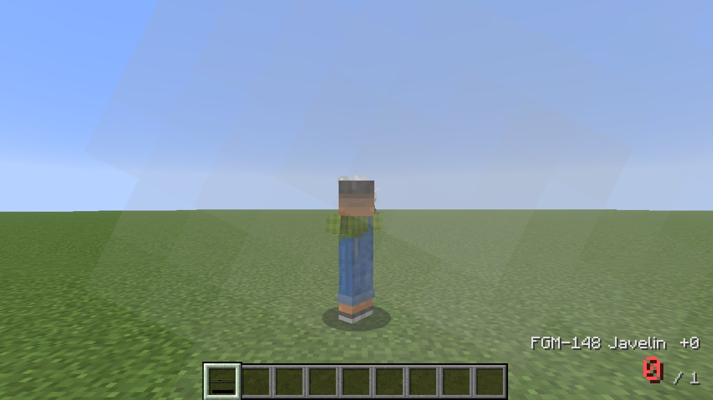 |

## Combat knife

A KA-BAR style fighting knife: as strong as an iron sword and half again as quick. **Stabbed from behind**, it does double damage. It is also the tool for disarming mines.

## Weapon racks and the ammunition crate

- **Weapon rack** (on a wall): holds three long guns, one above the other.
- **Gun stand** (on the floor): holds five upright.

Right click with a weapon to put it up (where you click), with an empty hand to take one down. Any single item fits, such as swords, bows and tridents. Broken racks drop what they hold.

The **ammunition crate** is an olive green box with 27 slots.

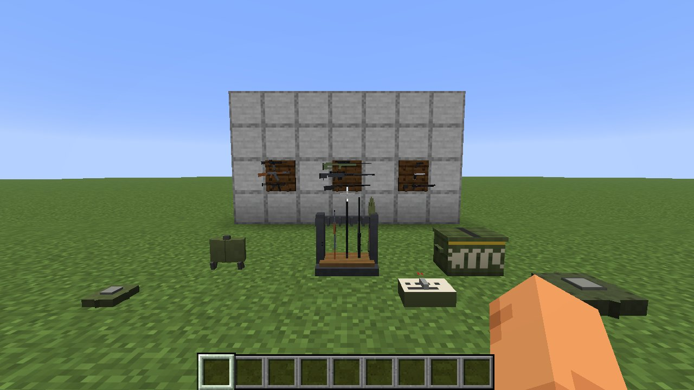
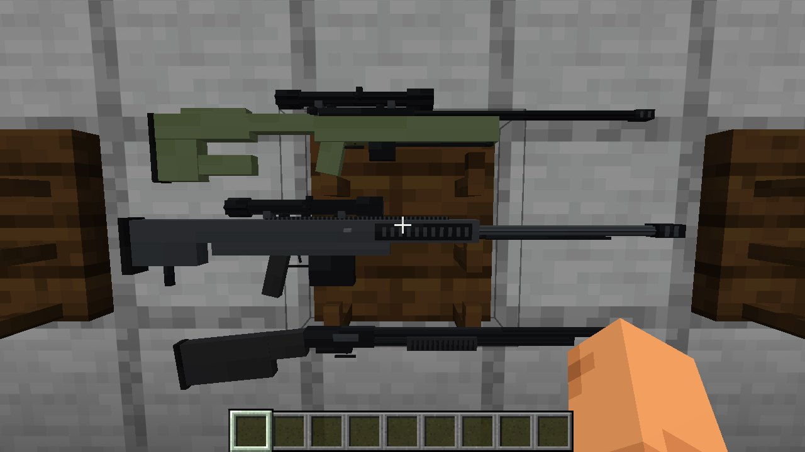

## Crafting

Parts:

| Part | Recipe |
|---|---|
| Polymer (4) | coal + slime ball |
| Gun barrel | 3 iron ingots in a row |
| Receiver | iron ingots, iron nugget, redstone |
| Riflescope | spyglass + 2 iron ingots |
| Brass casing (8) | copper ingot + iron nugget |
| Explosive charge | 2 gunpowder + clay ball |
| Kevlar fabric (2) | 8 string around a leather |
| Ceramic plate (2) | 5 bricks and an iron ingot |

Weapons are made of receivers, barrels, polymer, wood and iron. Long guns need more barrels, sniper rifles a scope and launchers explosive charges. Look them up in the recipe book. Grenades, mines and C4 need explosive charges; vests and helmets Kevlar fabric; the plate carrier ceramic plates too.

## Commands

| Command | |
|---|---|
| `/arsenal kit <loadout> [players]` | operators: hand out a loadout: `rifleman`, `sniper`, `breacher`, `demolition`, `antitank`, `officer` or `all` |

## Configuration

`config/arsenal.json`:

| Setting | Default | |
|---|---|---|
| `damageMultiplier` | 1.0 | all bullet damage is multiplied by this |
| `bulletsBreakGlass` | true | bullets and fragments shatter glass, panes and ice |
| `grenadeBlockDamage` | false | hand grenades break blocks |
| `rocketBlockDamage` | true | RPG and Javelin warheads break blocks |
| `c4BlockDamage` | true | C4 breaks blocks |
| `mineBlockDamage` | true | anti-tank mines break blocks |
| `claymoreSparesOwner` | true | a claymore's sensor never fires at whoever placed it |
| `backblast` | true | the RPG's backblast hurts whoever stands behind the shooter |
| `flashbangSeconds` | 6 | longest a flashbang blinds |
| `deafSeconds` | 8 | longest the ears ring |

## For other mods

From 1.1.0, `net.antwire.arsenal.api.ArsenalApi` lets any mob fire Arsenal's guns:
- `fire(shooter, "m4a1", yaw, pitch, inaccuracy)` fires real bullets, with muzzle flash, tracer and sound for everyone nearby. Body armour, cover and walls act on them as on a player's shots.
- `stack`, `magazine`, `interval` and `reloadTicks` describe each gun, and `reloadSound` plays a magazine change.

The caller counts the rounds itself. Civitas uses this API for its soldiers.

## Building from source

```
./gradlew build                                  # build/libs/arsenal-1.1.0.jar
./gradlew runClientGameTest -Pscenes=<scenes>    # the test range: weapons in hand, armour, firing, explosives, launchers, racks, HUD
python3 tools/gen_guns.py                        # gun, launcher, rocket and grenade models from real dimensions
python3 tools/gen_assets.py                      # textures, block models, language, recipes, loot tables
python3 tools/gen_sounds.py                      # every sound, synthesised
```

## License

MIT
